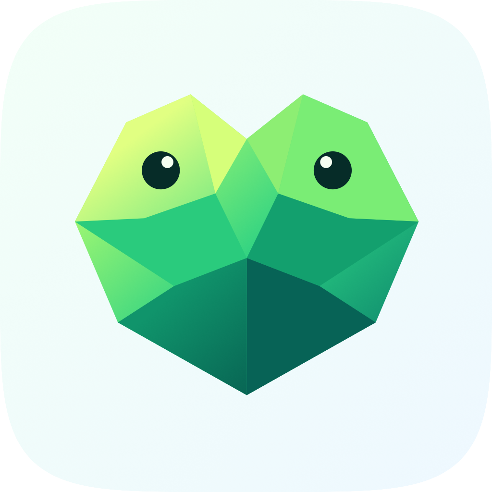

<p align="center">
  
</p>

<h1 align="center">Gifrog</h1>

<p align="center">
  <strong>菜单栏里的屏幕录制 & GIF 导出工具</strong>
</p>

<p align="center">
  <a href="LICENSE"></a>
  
  
</p>

<p align="center">
  <b>🌐 Language / 语言</b><br>
  <a href="README.md">English</a> · <a href="README.zh-CN.md">中文</a>
</p>

---

Gifrog 是一款 macOS 菜单栏工具，可以录制屏幕任意区域、窗口或全屏，并导出为优化的 GIF、MP4 或 WebM 格式。内置裁剪编辑器、鼠标点击高亮、一键复制到剪贴板。不占 Dock 栏，不打扰工作流——菜单栏里的一只小青蛙。

## 快速开始

```bash
# 克隆并构建
git clone git@github.com:Moosphan/Gifrog.git && cd Gifrog
swift build -c release

# 或打包为 .app
bash scripts/build_app.sh && open dist/Gifrog.app
```

**环境要求：** macOS 13+，Xcode 15+（或 Swift 5.10 工具链）

## 功能特性

- **三种录制模式** — 区域选取、窗口录制、全屏录制
- **多种导出格式** — GIF、MP4 (H.264)、WebM (VP9)
- **内置编辑器** — 视频预览、时间线裁剪、实时文件大小预估
- **鼠标点击高亮** — 录制时自动标记鼠标点击位置
- **全局快捷键** — `⌥⇧G` 随时开始/停止录制
- **剪贴板集成** — 导出文件自动复制到剪贴板
- **拖拽导入** — 支持导入 MP4、MOV、M4V、WebM 文件
- **崩溃恢复** — 启动时自动恢复未完成的录制
- **开机自启** — 可选的 macOS ServiceManagement 自动启动

## 使用方法

1. **启动** — 菜单栏出现青蛙图标
2. **选择模式** — 点击图标 → 区域 / 窗口 / 全屏
3. **录制** — 使用浮动工具栏暂停或停止
4. **编辑导出** — 在编辑器中裁剪，选择格式和质量，导出

### 快捷键

| 快捷键 | 功能 |
|--------|------|
| `⌥⇧G` | 开始 / 停止录制 |
| `Space` | 暂停 / 继续 |
| `Esc` | 取消录制 |

## 配置选项

点击弹出窗口中的齿轮图标打开设置：

| 设置项 | 默认值 | 可选值 |
|--------|--------|--------|
| 帧率 | 15 fps | 10 / 15 / 24 / 30 |
| 缩放 | 100% | 100% / 75% / 50% |
| 格式 | GIF | GIF / MP4 / WebM |
| 质量 | 中等 | 低 / 中 / 高 |
| 倒计时 | 3 秒 | 0 / 3 / 5 秒 |
| 显示光标 | 开 | 开 / 关 |
| 点击高亮 | 开 | 开 / 关 |
| 开机自启 | 关 | 开 / 关 |
| 保存路径 | `~/Movies/Gifrog` | 自定义路径 |

## 项目架构

```
Sources/Gifrog/
├── main.swift                    # 应用入口
├── Models.swift                  # 数据模型
├── Controllers/                  # AppKit 窗口与状态管理
│   ├── GifrogController.swift    # 核心协调器
│   ├── StatusBarController.swift # 菜单栏图标与弹出窗口
│   └── ...
├── Recording/                    # 屏幕录制管线
│   ├── ScreenCaptureRecorder.swift  # 基于 ScreenCaptureKit
│   ├── FrameRecorder.swift          # 录制编排器
│   └── ClickEventRecorder.swift     # 鼠标点击捕获
├── Export/                       # 基于 FFmpeg 的导出
│   └── ExportManager.swift
├── Views/                        # SwiftUI 视图
└── Resources/                    # 应用图标资源
```

## 技术栈

| 组件 | 技术 |
|------|------|
| 语言 | Swift 5.10 |
| 构建 | Swift Package Manager |
| UI | SwiftUI + AppKit |
| 录制 | ScreenCaptureKit |
| 视频 | AVFoundation |
| 导出 | FFmpeg |
| 快捷键 | Carbon HIToolbox |

## 许可证

[Apache License 2.0](LICENSE) © 2026 Gifrog
